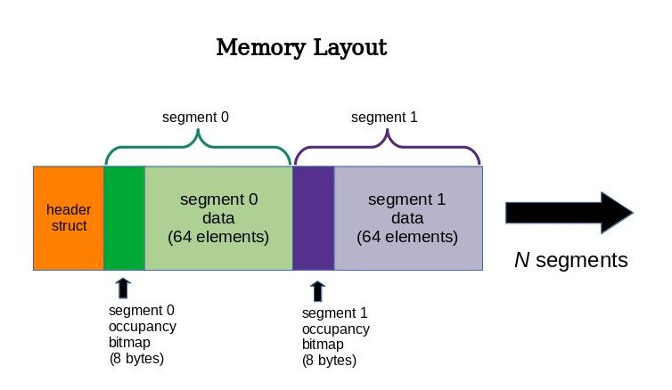

# LooseVector
##  Vector Implementations in C

### lvec_t

 - A resizable vector that holds elements of equal width. Data elements are stored in contiguous memory.
 - Vector holds an arbitary number of segments, each segment holds 64 elements.
   - Each sector uses 1x `uint64_t` bitmap in order to find gaps.
 - `lvec_get_pointer_to_vacant_slot` will reference each segments' bitmap in order intil it finds the first vacant slot (slot with the lowest index).

Deleting items causes the vector to become fragmented. Adding new items fills in the gaps.



### lvec64_t

 - A resizable vector that holds elements of equal width. Data elements are stored in contiguous memory.
 - Max capacity is 64 elements.
   - The vector uses a `uint64_t` bitmap in order to find gaps.
   - Resizing is limited to the number of bits in `uint64_t`
 - `lvec64_get_pointer_to_vacant_slot` will reference bitmap in order to find the first vacant slot (slot with the lowest index).


Deleting items causes the vector to become fragmented. Adding new items fills in the gaps.


TODO: add a `last_provisioned_index` field to `lvec64_t` and set this to the index of the most recently assigned index.

Example usage:
```c

typedef struct test_object_t {
  int a;
  int b;
} test_object_t;


// create vector that can initially hold 16 objects, and grows 16 at a time.
lvec64_t *v = lvec64_create(
    sizeof (test_object_t),
    16,
    16
);

// load data into the vector
test_object_t *val1 = lvec64_get_pointer_to_vacant_slot(&v);
val1->a = 12;
val1->b = 16;
test_object_t *val2 = lvec64_get_pointer_to_vacant_slot(&v);
val2->a = 123;
val2->b = 234;


// remove data at index 0
lvec64_vacate_slot(v, 0);


// free memory
lvec64_free(v);

```


Iteration example:
```c

uint32_t found_elements = 0;
for(
    uint32_t i=0;
    i < v->element_count_max && found_elements < v->element_count;
    i++
){
    if(!lvec64_index_is_occupied(v, i)) continue;
    found_elements++;

}

```

When compiling with optimizations consider testing performance without `found_elements` counter.


<hr>
